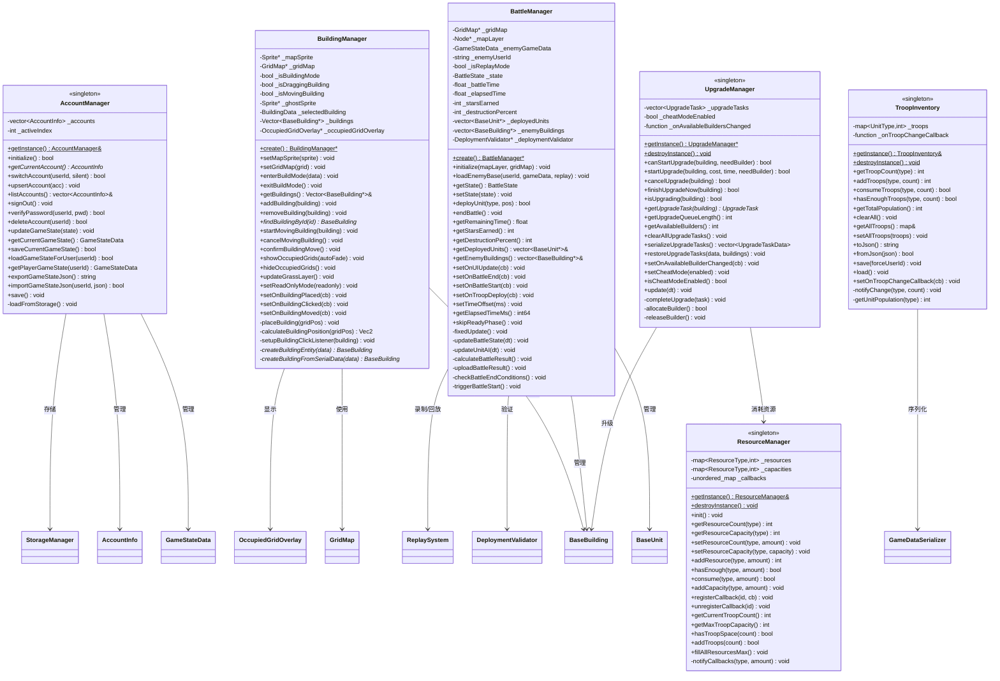

# ⚔️ Clash of Clans - 程序设计范式期末项目


> 基于 **Cocos2d-x 4.0** 开发的塔防策略游戏，支持本地多账号管理、Socket 网络通信、本地账号之间对战、联机部落之内对战及战斗回放功能。

---

## 🛠️ 项目环境

### 开发工具

| 工具 | 版本要求 | 备注 |
| :--- | :--- | :--- |
|  | **2022** | Windows 开发环境 |
|  | **2025.2.2** | Android 打包与调试 |
| **CMake** | **3.10** | 构建工具 |
| **NDK** | **r19c** | 版本号 19.2.5345600 |

### 技术栈

| 模块 | 技术选型 | 版本/配置 |
| :--- | :--- | :--- |
| **引擎核心** | Cocos2d-x | 4.0 (基于 C++14) |
| **构建系统** | Gradle | 8.0 (AGP 7.4.2) |
| **Java环境** | Java Development Kit | jdk-11 |
| **Python环境** | Python | 2.7 (Cocos 命令行依赖) |
| **网络通信** | BSD Socket | TCP / Blocking Mode |
| **数据交换** | RapidJSON | JSON 序列化 |

### Android 配置 (`app/build.gradle`)

```gradle
android {
    compileSdkVersion 33
    minSdkVersion 19
    targetSdkVersion 33
    ndkVersion "19.2.5345600"

    defaultConfig {
        externalNativeBuild {
            cmake {
                // 关键编译参数
                arguments "-DCMAKE_FIND_ROOT_PATH=",
                          "-DANDROID_STL=c++_static",
                          "-DANDROID_TOOLCHAIN=clang",
                          "-DANDROID_ARM_NEON=TRUE",
                          "-j8"
            }
        }
    }
}
```

---

## 项目结构

```text
coc/
├── Classes/                      # 核心代码逻辑
│   ├── Buildings/                # 建筑系统 (Base, TownHall, Defense...)
│   ├── Unit/                     # 单位系统 (Base, CombatStats, Types...)
│   ├── Managers/                 # 管理器 (Account, Building, Battle, Resource...)
│   ├── Scenes/                   # 场景 (Login, Map, Battle)
│   ├── UI/                       # 界面组件 (HUD, Shop, Settings)
│   └── Services/                 # 服务层 (Upgrade, Clan)
├── Server/                       # 服务器端代码 (C++ Socket)
├── Resources/                    # 游戏资源 (图片, 字体, 声音, 地图)
│   ├── buildings/
│   ├── units/
│   └── map/
├── proj.win32/                   # Windows 工程文件
├── proj.android/                 # Android 工程文件
└── CMakeLists.txt                # CMake 构建配置
```

---

## 🚀 编译与运行

### 💻 Windows 平台

1.  **打开项目**：进入 `proj.win32` 目录，双击 `HelloCpp.sln`。
2.  **配置**：在 Visual Studio 中选择 **Debug** 或 **Release** 以及 **x86**。
3.  **编译服务器**：右键 `Server` 项目 -> **生成**。
    * 运行：`proj.win32/bin/Server/Release/Server.exe`
4.  **运行客户端**：右键 `HelloCpp` 项目 -> **设为启动项目** -> **F5**。

### 🤖 Android 平台（超级加分项）

> 📱 **本项目已成功适配并运行于 Android 平台！**

1.  **打开项目**：启动 Android Studio，选择 `Open`，指向 `proj.android` 目录。
2.  **同步**：等待 Gradle Sync 完成（如网络不通请配置代理）。
3.  **部署**：连接真机或启动模拟器，点击顶部绿色的 **Run** 按钮。

---

## 核心功能模块

### 🏰 1. 建筑系统 (Building System)
* **多类型支持**：大本营 (Lv.17)、资源设施、防御塔、兵营、城墙 (Lv.16)。
* **交互逻辑**：支持拖拽放置、点击升级、点击移动。
* **工人机制**：基于工人数量的并行升级队列管理。

### 💰 2. 资源系统 (Economy)
* **产出与存储**：金矿/圣水收集器生产，金库/圣水瓶存储。
* **动态计算**：基于大本营等级和存储建筑等级动态计算容量上限。
* **动画反馈**：点击收集时的资源飞入动画。

### ⚔️ 3. 战斗系统 (Battle System)
* **完整状态机**：
    * `LOADING` → 加载敌方基地数据
    * `READY` → 准备阶段（30秒观察期，战斗计时器暂停）
    * `FIGHTING` → 战斗进行中（首次部署单位后触发）
    * `FINISHED` → 战斗结束
* **双模式支持**：
    * **PVE**：单机挑战离线玩家(本地其他账号)镜像。
    * **PVP**：在线实时 Socket 对战，支持观战模式。
* **智能 AI**：基于 A* 寻路的自动索敌、攻击判定、城墙破坏逻辑。
* **结算体系**：0-3 星评级、摧毁百分比、资源掠夺量、奖杯升降。
* **固定时间步长**：60 FPS 物理更新，确保回放一致性。

### 🌐 4. 网络与多人 (Network & Multiplayer)
* **Socket 通信**：自定义 TCP 协议，支持多线程并发处理。
* **部落功能**：创建部落、成员管理、部落战匹配。
* **数据同步**：玩家数据本地备份，支持多设备登录。
* **观战同步**：支持实时时间偏移同步，观战者可中途加入。

### 📹 5. 高级特性
* **回放系统**：采用**指令序列化**技术，重现整场战斗过程（下兵位置、时机）。
* **防守日志**：记录离线期间的被攻击记录，支持一键回放。
* **多账号**：本地支持无缝切换多个游戏账号，数据完全隔离。

---

## 团队成员与分工

| 成员   | 刘相成（2452207）                                            | 薛毓哲（2453619）                                            | 赵崇治（2452098）                                            |
| :----- | ------------------------------------------------------------ | ------------------------------------------------------------ | ------------------------------------------------------------ |
| 分工   | 主场景与地图前期工作，大本营与建筑升级系统实现，资源生成类功能实现，全局资源数量匹配实现，建筑放置功能与血量显示实现，建筑升级时间与加速系统，资源栏实现，商店实现，AI寻路初步实现，UI初步，测试Bug，整合文档 | 建筑工人小屋的图像与功能实现，防御类的图像与功能实现，兵营与训练营的图像与功能实现，各类小兵的图像、放置、数量、血量与功能（各类战斗特色与优先目标）实现，战斗功能实现，优化AI寻路，修改Bug，处理内存泄漏 | 地图切换与网格化，建筑可移动实现，音乐功能实现，联网功能实现，防守日志与回放功能实现，部落与联机功能实现，账号创建、切换与保存功能实现，战斗功能优化，优化AI寻路，UI优化，修Bug，代码结构的合并与优化，实现安卓平台运行 |
| 贡献度 | 33.33%                                                       | 33.33%                                                       | 33.33%                                                       |

---

## 期末项目文档对应要求

### 基础功能 (Basic Features)
- **核心系统**: 完整的主村庄与大本营 (Town Hall) **多升级体系**。
- **资源管理**: 金币 (Gold)、圣水 (Elixir) 采集与存储，小兵容量管理以及（**额外添加**）建筑工人容量管理。
- **建筑体系**:
  - **资源生成**：金矿、圣水收集器。
  - **资源储存**：金币/圣水仓库。
  - **军事**: 兵营 (Barracks)、兵营驻地 (Army Camp)。
  - **防御**: 加农炮 (Cannon)、弓箭塔 (Archer Tower)、（**额外添加**）城墙 (Wall)。
- **兵种单位**:
  - 野蛮人 (Barbarian)
  - 弓箭手 (Archer)
  - 巨人 (Giant) - 优先攻击防御建筑
  - 炸弹人 (Wall Breaker)-伤害高
  - （**额外添加**）哥布林 (Goblin) - 优先攻击资源
- **AI 战斗系统**:
  - 基于网格的 A* 寻路算法。
  - 智能目标搜索与攻击优先级判定。
- **战斗流程**:
  - 自由投放兵种，支持多点触控。
  - 自动战斗逻辑与胜负星级判定 (0-3星)。
- **视听体验**: 支持多地图切换，包含完整的背景音乐与战斗音效。

### 扩展功能 (Advanced Features)
- **联机对战 (Multiplayer/PVP 进攻）**: 匹配并攻击其他玩家的村庄，支持**实时 PVP 对战**。
- **观战模式 (Spectator)**: 实时观看正在进行的战斗（部落内 PVP 战斗）。
- **部落系统 (Clan)**: 创建或加入部落，查看成员列表，参与**部落战 (Clan War)**及**实时观战**。
- **回放系统 (Replay)**: 完整记录并回放战斗过程(包括本地账号战斗与联机部落内战斗)。
- **防守日志 (Defense Log)**: 查看被攻击记录。
- **建筑升级加速**: 真实的建筑施工/升级加速时间机制。
- **建筑工人匹配升级**:限制同一时刻最大升级数量。
- **账号创建与删除**:本地支持无缝切换多个游戏账号，数据完全隔离。
- **本地存储**:玩家数据云端/本地双重备份，支持多设备登录。

---

## 💻 C++ 特性与代码规范

本项目严格遵循 C++14 标准开发，代码质量符合高标准要求。

### 1. C++ 特性应用 (C++ Features)
*   **STL 容器 (STL Containers)**: 广泛使用 `std::vector`, `std::map`, `std::unordered_map`, `std::queue` 管理游戏对象与资源数据。
*   **迭代器 (Iterators)**: 使用迭代器遍历容器，结合 C++11 range-based for loop 提升代码可读性。
*   **类与多态 (Classes & Polymorphism)**: 采用继承与虚函数实现建筑系统 (`BaseBuilding`) 和单位系统，利用多态处理不同类型的游戏实体。
*   **模板 (Templates)**: 在序列化模块中使用模板函数实现通用的 JSON 解析逻辑。
*   **函数 & 操作符重载 (Function & Operator Overloading)**: 在数据模型类（如 `GameStateData`）中重载赋值运算符，简化对象复制与状态同步。
*   **异常处理 (Exception Handling)**: 关键逻辑（如初始化、文件读写）使用 `try-catch` 捕获异常，防止程序崩溃。
*   **C++11/14 新特性**:
    *   **并发编程**: 使用 `std::thread`, `std::mutex`, `std::atomic`, `std::lock_guard` 实现网络层的线程安全。
    *   **Lambda 表达式**: 在 UI 事件回调和算法中使用 Lambda 简化代码。
    *   **智能指针与移动语义**: 使用 `std::move` 优化对象拷贝，结合 Cocos2d 内存管理机制。
    *   **类型推导**: 合理使用 `auto` 关键字。
    *   **跨平台兼容**: 使用预处理指令 (`#ifdef`) 处理 Windows/Android 平台差异（如 Socket 实现）。

### 2. 代码质量控制 (Code Quality)
*   **类型转换**: 摒弃 C 风格转换，全面使用 `static_cast` 进行算术/枚举转换，使用 `dynamic_cast` 进行安全的运行时多态转换。
*   **Const 正确性**: 严格使用 `const` 修饰只读成员函数和参数，保证数据安全性。
*   **代码风格**: 遵循 Google C++ Style 命名规范（类名 PascalCase，变量 camelCase，成员变量带下划线前缀），代码格式统一。
*   **注释规范**: 所有核心类和复杂算法均包含详细的 Doxygen 风格注释和文件头说明。

---

## 🏆 项目质量与加分项

本项目在代码质量、开发规范、用户体验等方面均达到高标准要求，具体如下：

### ✅ 版本控制与协作 (Version Control & Collaboration)

| 要求 | 完成情况 | 说明 |
|:---|:---:|:---|
| **GitHub 使用规范** | ✅ | 使用 Git 进行版本管理，团队协作开发 |
| **合理分工** | ✅ | 三人团队明确分工：场景/UI/建筑、单位/战斗/AI、网络/回放/跨平台 |
| **Commit 记录清晰** | ✅ | 提交信息描述明确，便于追溯代码变更历史 |

### ✅ 代码质量 (Code Quality)

| 要求 | 完成情况 | 说明 |
|:---|:---:|:---|
| **合理异常处理** | ✅ | 关键逻辑使用 `try-catch` 捕获异常，JSON 解析、文件读写、网络通信均有错误处理 |
| **无内存泄漏** | ✅ | 结合 Cocos2d 引用计数机制，手动管理对象生命周期，专人负责内存泄漏检测与修复 |
| **代码规范** | ✅ | 遵循 Google C++ Style，命名规范统一，Doxygen 风格注释覆盖核心模块 |

### ✅ 开发特性 (Development Features)

| 要求 | 完成情况 | 说明 |
|:---|:---:|:---|
| **C++11/14/17 特性丰富** | ✅ | `std::thread`/`std::mutex`/`std::atomic` 多线程、Lambda 表达式、`auto` 类型推导、`std::move` 移动语义、模板函数、range-based for loop |
| **优雅架构设计** | ✅ | 分层架构（Scene → Manager → Service → Data），单例模式、工厂模式、观察者模式应用 |
| **目录结构清晰** | ✅ | `Classes/` 按功能模块划分：Buildings、Unit、Managers、Scenes、UI、Services |

### ✅ 界面与体验 (UI & UX)

| 要求 | 完成情况 | 说明 |
|:---|:---:|:---|
| **界面精美** | ✅ | 高清建筑/单位素材，统一 UI 风格，资源栏、商店、升级面板设计美观 |
| **游戏不卡顿不崩溃** | ✅ | 60 FPS 固定时间步长更新，内存管理严格，长时间运行稳定 |
| **流畅动画** | ✅ | 单位行走/攻击/死亡动画、建筑升级动画、资源收集飞入动画、UI 缓动效果 |

### 🌟 超级加分项 (Bonus Features)

| 加分项 | 完成情况 | 说明 |
|:---|:---:|:---|
| **成功运行于 Android** | ✅ | 完整适配 Android 平台，支持 Android Studio 编译部署，真机/模拟器均可运行 |

> 📱 **Android 平台说明**：项目包含完整的 `proj.android` 工程，配置 NDK r19c + Gradle 8.0，支持 ARM/ARM64 架构，最低支持 Android 5.0 (API 19)，目标 SDK 33。

---

## 📡 网络通信协议

项目采用自定义的 **包头 + 包体** 二进制协议。

### 协议结构
```cpp
struct PacketHeader {
    uint32_t type;      // 消息 ID
    uint32_t length;    // 包体长度
};
```

### 常用消息 ID
| ID | 宏定义 | 方向 | 描述 |
| :--- | :--- | :--- | :--- |
| **1** | `PACKET_LOGIN` | C → S | 身份验证与登录 |
| **2** | `PACKET_UPLOAD_MAP` | C → S | 同步本地地图数据 |
| **10** | `PACKET_FIND_MATCH` | C → S | 请求 PVP 匹配 |
| **13** | `PACKET_ATTACK_START` | C → S | 发送攻击指令 |
| **14** | `PACKET_ATTACK_RESULT` | C ↔ S | 战斗结算与回放数据 |

---

## 💾 数据持久化模型

数据存储采用 JSON 格式，路径如下：
* **Win32**: `%LOCALAPPDATA%\HelloCpp\`
* **Android**: `/data/data/org.cocos2dx.hellocpp/files/`

```json
{
  "userId": "player_1001",
  "resources": {
    "gold": 15000,
    "elixir": 23000,
    "gems": 50
  },
  "buildings": [
    { "id": 1, "type": "TownHall", "level": 5, "x": 20, "y": 20 },
    { "id": 2, "type": "Cannon", "level": 3, "x": 24, "y": 18 }
  ]
}
```

---

## 🏗️ 架构设计

项目采用分层架构设计，确保逻辑与表现分离。以下是完整的类关系图和各模块详细说明。

### 📋 Classes 目录完整类清单

项目 `Classes/` 目录下共包含 **67 个头文件**，按模块分类如下：

| 模块 | 文件数 | 类/结构体 |
|:---|:---:|:---|
| **App** | 1 | `AppDelegate` |
| **Buildings** | 10 | `BaseBuilding`, `TownHallBuilding`, `DefenseBuilding`, `ResourceBuilding`, `ArmyBuilding`, `ArmyCampBuilding`, `WallBuilding`, `BuildersHutBuilding`, `BuildingConfig`, `BuildingData`, `BuildingUpgradeUI` |
| **GridMap** | 1 | `GridMap` |
| **Managers** | 31 | `AccountManager`, `BattleManager`, `BuildingCapacityManager`, `BuildingLimitManager`, `BuildingManager`, `ClanDataCache`, `DefenseLogSystem`, `DeploymentValidator`, `GameConfig`, `GameDataModels`, `GameDataRepository`, `GameDataSerializer`, `GlobalAudioManager`, `HUDLayer`, `InputController`, `JsonSerializer`, `MapConfigManager`, `MapController`, `MusicManager`, `NetworkManager`, `OccupiedGridOverlay`, `ReplaySystem`, `ResourceCollectionManager`, `ResourceManager`, `SceneUIController`, `ShopLayer`, `SocketClient`, `StorageManager`, `TownHallSystem`, `TroopInventory`, `UpgradeManager` |
| **Scenes** | 4 | `HelloWorldScene`, `AccountSelectScene`, `DraggableMapScene`, `BattleScene` |
| **Services** | 2 | `BuildingUpgradeService`, `ClanService` |
| **UI** | 9 | `BattleUI`, `BuildingHealthBarUI`, `ClanPanel`, `PlayerListItem`, `PlayerListLayer`, `ResourceCollectionUI`, `SettingsPanel`, `UnitHealthBarUI`, `UpgradeTimerUI` |
| **Unit** | 12 | `BaseUnit`, `BarbarianUnit`, `ArcherUnit`, `GiantUnit`, `GoblinUnit`, `WallBreakerUnit`, `UnitFactory`, `PathFinder`, `TrainingUI`, `CombatStats`, `UnitTypes`, `PathNode` |

---

### 整体架构概览

```mermaid
graph TB
    subgraph "🚀 应用入口 App"
        AppDelegate[AppDelegate<br/>应用程序入口]
    end

    subgraph "🎬 场景层 Scenes"
        HelloWorld[HelloWorldScene<br/>启动场景]
        AccountSelect[AccountSelectScene<br/>账号选择场景]
        DraggableMap[DraggableMapScene<br/>主村庄场景]
        BattleScene[BattleScene<br/>战斗场景]
    end

    subgraph "🖼️ UI层 User Interface"
        HUDLayer[HUDLayer<br/>顶部资源栏]
        ShopLayer[ShopLayer<br/>商店界面]
        BattleUI[BattleUI<br/>战斗界面]
        ClanPanel[ClanPanel<br/>部落面板]
        SettingsPanel[SettingsPanel<br/>设置面板]
        PlayerListLayer[PlayerListLayer<br/>玩家列表]
        PlayerListItem[PlayerListItem<br/>玩家列表项]
        BuildingHealthBarUI[BuildingHealthBarUI<br/>建筑血条]
        UnitHealthBarUI[UnitHealthBarUI<br/>单位血条]
        ResourceCollectionUI[ResourceCollectionUI<br/>资源收集UI]
        UpgradeTimerUI[UpgradeTimerUI<br/>升级计时UI]
        TrainingUI[TrainingUI<br/>训练界面]
        BuildingUpgradeUI[BuildingUpgradeUI<br/>建筑升级UI]
        TownHallUpgradeUI[TownHallUpgradeUI<br/>大本营升级UI]
        ResourceDisplayUI[ResourceDisplayUI<br/>资源显示UI]
    end

    subgraph "⚙️ 管理器层 Managers"
        AccountManager[AccountManager<br/>账号管理器]
        BuildingManager[BuildingManager<br/>建筑管理器]
        BattleManager[BattleManager<br/>战斗管理器]
        ResourceManager[ResourceManager<br/>资源管理器]
        UpgradeManager[UpgradeManager<br/>升级管理器]
        TroopInventory[TroopInventory<br/>士兵库存]
        NetworkManager[NetworkManager<br/>HTTP网络管理器]
        SocketClient[SocketClient<br/>Socket客户端]
        ReplaySystem[ReplaySystem<br/>回放系统]
        DefenseLogSystem[DefenseLogSystem<br/>防守日志系统]
        MusicManager[MusicManager<br/>音乐管理器]
        GlobalAudioManager[GlobalAudioManager<br/>全局音频管理器]
        StorageManager[StorageManager<br/>存储管理器]
        MapConfigManager[MapConfigManager<br/>地图配置管理器]
        BuildingCapacityManager[BuildingCapacityManager<br/>建筑容量管理器]
        BuildingLimitManager[BuildingLimitManager<br/>建筑限制管理器]
        ResourceCollectionManager[ResourceCollectionManager<br/>资源收集管理器]
        ClanDataCache[ClanDataCache<br/>部落数据缓存]
        GameConfig[GameConfig<br/>游戏配置]
    end

    subgraph "🎮 控制器层 Controllers"
        MapController[MapController<br/>地图控制器]
        InputController[InputController<br/>输入控制器]
        SceneUIController[SceneUIController<br/>场景UI控制器]
    end

    subgraph "🔧 服务层 Services"
        BuildingUpgradeService[BuildingUpgradeService<br/>建筑升级服务]
        ClanService[ClanService<br/>部落服务]
    end

    subgraph "🏠 建筑系统 Buildings"
        BaseBuilding[BaseBuilding<br/>建筑基类]
        TownHallBuilding[TownHallBuilding<br/>大本营]
        DefenseBuilding[DefenseBuilding<br/>防御建筑]
        ResourceBuilding[ResourceBuilding<br/>资源建筑]
        ArmyBuilding[ArmyBuilding<br/>兵营]
        ArmyCampBuilding[ArmyCampBuilding<br/>军营]
        WallBuilding[WallBuilding<br/>城墙]
        BuildersHutBuilding[BuildersHutBuilding<br/>建筑工人小屋]
        BuildingConfig[BuildingConfig<br/>建筑配置管理]
    end

    subgraph "⚔️ 单位系统 Units"
        BaseUnit[BaseUnit<br/>单位基类]
        BarbarianUnit[BarbarianUnit<br/>野蛮人]
        ArcherUnit[ArcherUnit<br/>弓箭手]
        GiantUnit[GiantUnit<br/>巨人]
        GoblinUnit[GoblinUnit<br/>哥布林]
        WallBreakerUnit[WallBreakerUnit<br/>炸弹人]
        UnitFactory[UnitFactory<br/>单位工厂]
        PathFinder[PathFinder<br/>A*寻路器]
    end

    subgraph "🗺️ 地图系统 GridMap"
        GridMap[GridMap<br/>网格地图]
        OccupiedGridOverlay[OccupiedGridOverlay<br/>占用网格覆盖层]
        DeploymentValidator[DeploymentValidator<br/>部署验证器]
    end

    subgraph "📦 数据层 Data Models"
        GameStateData[GameStateData<br/>游戏状态数据]
        ResourceData[ResourceData<br/>资源数据]
        ProgressData[ProgressData<br/>进度数据]
        AccountData[AccountData<br/>账户数据]
        AccountInfo[AccountInfo<br/>账户信息]
        BuildingData[BuildingData<br/>建筑数据]
        BuildingSerialData[BuildingSerialData<br/>建筑序列化数据]
        BuildingConfigData[BuildingConfigData<br/>建筑配置数据]
        BuildingLevelData[BuildingLevelData<br/>建筑等级数据]
        BuildingConfigItem[BuildingConfigItem<br/>建筑配置项]
        CombatStats[CombatStats<br/>战斗属性]
        ReplayData[ReplayData<br/>回放数据]
        ReplayEvent[ReplayEvent<br/>回放事件]
        DefenseLog[DefenseLog<br/>防守日志]
        TrainingTask[TrainingTask<br/>训练任务]
        UpgradeTask[UpgradeTask<br/>升级任务]
        UpgradeTaskData[UpgradeTaskData<br/>升级任务数据]
        PathNode[PathNode<br/>寻路节点]
        PlayerInfo[PlayerInfo<br/>玩家信息]
        ClanInfo[ClanInfo<br/>部落信息]
        ClanMember[ClanMember<br/>部落成员]
        BattleStatus[BattleStatus<br/>战斗状态]
    end

    subgraph "🔢 枚举类型 Enums"
        BuildingType[BuildingType<br/>建筑类型]
        DefenseType[DefenseType<br/>防御类型]
        ResourceBuildingType[ResourceBuildingType<br/>资源建筑类型]
        ResourceType[ResourceType<br/>资源类型]
        UnitType[UnitType<br/>单位类型]
        UnitAction[UnitAction<br/>单位动作]
        UnitDirection[UnitDirection<br/>单位方向]
        BattleState[BattleState<br/>战斗状态]
        BattleMode[BattleMode<br/>战斗模式]
        BattleEndReason[BattleEndReason<br/>战斗结束原因]
        ReplayEventType[ReplayEventType<br/>回放事件类型]
    end

    subgraph "🔄 序列化层 Serialization"
        GameDataSerializer[GameDataSerializer<br/>游戏数据序列化器]
        GameDataRepository[GameDataRepository<br/>游戏数据仓库]
        JsonSerializer[JsonSerializer<br/>JSON序列化器]
    end

    %% 应用入口
    AppDelegate --> HelloWorld

    %% 场景层关系
    HelloWorld --> AccountSelect
    AccountSelect --> DraggableMap
    DraggableMap --> BattleScene
    
    %% 主村庄场景依赖
    DraggableMap --> MapController
    DraggableMap --> InputController
    DraggableMap --> SceneUIController
    DraggableMap --> BuildingManager
    DraggableMap --> HUDLayer
    DraggableMap --> ResourceCollectionManager
    DraggableMap --> SettingsPanel
    DraggableMap --> ShopLayer
    
    %% 战斗场景依赖
    BattleScene --> BattleManager
    BattleScene --> BattleUI
    BattleScene --> BuildingManager
    BattleScene --> GridMap
    
    %% UI层依赖
    HUDLayer --> ResourceManager
    ShopLayer --> BuildingManager
    ShopLayer --> GameConfig
    BattleUI --> TroopInventory
    ClanPanel --> ClanService
    SettingsPanel --> MusicManager
    SettingsPanel --> GlobalAudioManager
    PlayerListLayer --> PlayerListItem
    BuildingUpgradeUI --> UpgradeManager
    TrainingUI --> ArmyBuilding
    TrainingUI --> TroopInventory
    
    %% 管理器依赖
    BuildingManager --> GridMap
    BuildingManager --> BaseBuilding
    BuildingManager --> OccupiedGridOverlay
    BuildingManager --> BuildingData
    BattleManager --> BaseUnit
    BattleManager --> BaseBuilding
    BattleManager --> ReplaySystem
    BattleManager --> DeploymentValidator
    BattleManager --> GridMap
    BattleManager --> UnitFactory
    AccountManager --> GameStateData
    AccountManager --> AccountInfo
    AccountManager --> StorageManager
    UpgradeManager --> BaseBuilding
    UpgradeManager --> ResourceManager
    UpgradeManager --> UpgradeTask
    TroopInventory --> GameDataSerializer
    ResourceCollectionManager --> ResourceBuilding
    ResourceCollectionManager --> ResourceCollectionUI
    BuildingCapacityManager --> ResourceManager
    BuildingLimitManager --> GameConfig
    GameConfig --> BuildingConfigItem
    
    %% 服务层依赖
    ClanService --> SocketClient
    ClanService --> ClanDataCache
    BuildingUpgradeService --> UpgradeManager
    BuildingUpgradeService --> ResourceManager
    
    %% 建筑继承关系
    TownHallBuilding --> BaseBuilding
    DefenseBuilding --> BaseBuilding
    ResourceBuilding --> BaseBuilding
    ArmyBuilding --> BaseBuilding
    ArmyCampBuilding --> BaseBuilding
    WallBuilding --> BaseBuilding
    BuildersHutBuilding --> BaseBuilding
    BaseBuilding --> BuildingConfig
    BuildingConfig --> BuildingLevelData
    
    %% 单位继承关系
    BarbarianUnit --> BaseUnit
    ArcherUnit --> BaseUnit
    GiantUnit --> BaseUnit
    GoblinUnit --> BaseUnit
    WallBreakerUnit --> BaseUnit
    UnitFactory --> BaseUnit
    
    %% 战斗相关
    BaseUnit --> PathFinder
    BaseUnit --> CombatStats
    BaseUnit --> UnitHealthBarUI
    BaseBuilding --> CombatStats
    BaseBuilding --> BuildingHealthBarUI
    DefenseBuilding --> BaseUnit
    PathFinder --> PathNode
    PathFinder --> GridMap
    
    %% 数据关系
    GameStateData --> ResourceData
    GameStateData --> ProgressData
    GameStateData --> BuildingSerialData
    GameStateData --> UpgradeTaskData
    AccountInfo --> AccountData
    AccountInfo --> GameStateData
    ClanDataCache --> PlayerInfo
    ClanDataCache --> ClanInfo
    ClanDataCache --> ClanMember
    ClanDataCache --> BattleStatus
    
    %% 数据序列化
    GameDataSerializer --> GameStateData
    GameDataSerializer --> BuildingSerialData
    GameDataRepository --> GameDataSerializer
    GameDataRepository --> StorageManager
    
    %% 网络相关
    SocketClient --> NetworkManager
    ReplaySystem --> ReplayData
    ReplaySystem --> ReplayEvent
    DefenseLogSystem --> DefenseLog
    
    %% 音频相关
    MusicManager --> GlobalAudioManager
```



---

### 📦 模块详细类图

#### 1. 建筑系统 (Building System)


#### 2. 单位系统 (Unit System)


#### 3. 管理器系统 (Manager System)



#### 4. 网络与服务系统 (Network & Service System)


#### 5. 数据模型与序列化 (Data Models & Serialization)


#### 6. 场景与控制器 (Scenes & Controllers)


---

### 🔗 核心类关系说明

| 模块 | 核心类 | 职责 | 关联类 |
|:---|:---|:---|:---|
| **场景层** | `DraggableMapScene` | 主村庄场景，管理地图交互 | `MapController`, `InputController`, `BuildingManager`, `HUDLayer` |
| | `BattleScene` | 战斗场景，管理战斗流程 | `BattleManager`, `BattleUI`, `GridMap` |
| **建筑系统** | `BaseBuilding` | 建筑基类，定义通用接口 | `CombatStats`, `BuildingHealthBarUI`, `BuildingConfigData` |
| | `BuildingManager` | 建筑放置与管理 | `GridMap`, `BaseBuilding`, `OccupiedGridOverlay` |
| **单位系统** | `BaseUnit` | 单位基类，定义通用行为 | `CombatStats`, `PathFinder`, `UnitHealthBarUI` |
| | `UnitFactory` | 单位创建工厂 | `BarbarianUnit`, `ArcherUnit`, `GiantUnit`, `GoblinUnit`, `WallBreakerUnit` |
| **战斗系统** | `BattleManager` | 战斗逻辑控制 | `BaseUnit`, `BaseBuilding`, `ReplaySystem`, `DeploymentValidator` |
| | `PathFinder` | A*寻路算法实现 | `GridMap` |
| **资源系统** | `ResourceManager` | 资源数量与容量管理 | `HUDLayer`, `UpgradeManager` |
| | `ResourceBuilding` | 资源生产与存储建筑 | `ResourceCollectionUI`, `ResourceCollectionManager` |
| **升级系统** | `UpgradeManager` | 建筑升级队列管理 | `BaseBuilding`, `ResourceManager`, `UpgradeTimerUI` |
| | `BuildingUpgradeService` | 升级业务逻辑封装 | `UpgradeManager`, `ResourceManager` |
| **账号系统** | `AccountManager` | 多账号管理 | `GameStateData`, `StorageManager`, `AccountInfo` |
| **网络系统** | `SocketClient` | TCP Socket通信 | `ClanService`, `BattleManager` |
| | `ClanService` | 部落业务逻辑 | `SocketClient`, `ClanDataCache`, `ClanPanel` |
| **回放系统** | `ReplaySystem` | 战斗录制与回放 | `ReplayData`, `ReplayEvent`, `BattleManager` |
| | `DefenseLogSystem` | 防守日志管理 | `DefenseLog`, `BattleScene` |
| **数据层** | `GameStateData` | 游戏状态数据模型 | `BuildingSerialData`, `AccountManager` |
| | `GameDataSerializer` | JSON序列化工具 | `GameStateData`, `GameDataRepository` |

---

## ❓ 常见问题 (FAQ)

<details>
<summary><strong>Q: 编译时提示 NDK 版本错误？</strong></summary>

> 请确保在 Android Studio 的 SDK Tools 中勾选 "Show Package Details"，并下载版本 **19.2.5345600**。
</details>

<details>
<summary><strong>Q: 运行后无法连接服务器？</strong></summary>

> 1. 确保 `Server.exe` 正在运行且未被防火墙拦截。
> 2. 如果是模拟器运行，请将连接 IP 改为 `10.0.2.2`。
> 3. 真机调试请确保手机与电脑在同一局域网，并填写电脑的局域网 IP。
</details>

<details>
<summary><strong>Q: 游戏内文字显示方块或乱码？</strong></summary>

> 检查 `Resources/fonts/` 下的 TTF 字体文件是否完整，且代码中引用的字体名称是否正确。
</details>

---

## 许可证

本项目采用 [MIT License](LICENSE) 进行许可。