# ⚔️ Clash of Clans - 程序设计范式期末项目


> 基于 **Cocos2d-x 4.0** 开发的塔防策略游戏，支持本地多账号管理、Socket 网络通信、本地账号之间对战、联机部落之内对战及战斗回放功能。测试联网功能的基础环境详见文档最后的常见问题第四个，具体游戏操作详见PPT视频。

---

## 📸 游戏截图 (Game Preview)

| 主界面 / 基地建设 | 战斗场景 / 施放单位 |
| :---: | :---: |
|  |  |
| *自定义布局与建筑升级* | *实时寻路与战斗特效* |

| 部落系统 / 聊天 | 回放系统 / 防守日志 |
| :---: | :---: |
|  |  |
| *多人在线聊天与捐兵* | *完整复盘战斗过程* |

---

## 🛠️ 项目环境

### 开发工具

| 工具 | 版本要求 | 备注 |
| :--- | :--- | :--- |
|  | **2022** | Windows 开发环境 |
|  | **2025.2.2** | Android 打包与调试 |
| **CMake** | **3.10** | 构建工具 |
| **NDK** | **r19c** | 版本号 19.2.5345600 |

### 技术栈

| 模块 | 技术选型 | 版本/配置 |
| :--- | :--- | :--- |
| **引擎核心** | Cocos2d-x | 4.0 (基于 C++14) |
| **构建系统** | Gradle | 8.0 (AGP 7.4.2) |
| **Java环境** | Java Development Kit | jdk-11 |
| **Python环境** | Python | 2.7 (Cocos 命令行依赖) |
| **网络通信** | BSD Socket | TCP / Blocking Mode |
| **数据交换** | RapidJSON | JSON 序列化 |

### Android 配置 (`app/build.gradle`)

```gradle
android {
    compileSdkVersion 33
    minSdkVersion 19
    targetSdkVersion 33
    ndkVersion "19.2.5345600"

    defaultConfig {
        externalNativeBuild {
            cmake {
                // 关键编译参数
                arguments "-DCMAKE_FIND_ROOT_PATH=",
                          "-DANDROID_STL=c++_static",
                          "-DANDROID_TOOLCHAIN=clang",
                          "-DANDROID_ARM_NEON=TRUE",
                          "-j8"
            }
        }
    }
}
```

---

## 项目结构

```text
coc/
├── Classes/                      # 核心代码逻辑
│   ├── Buildings/                # 建筑系统 (Base, TownHall, Defense...)
│   ├── Unit/                     # 单位系统 (Base, CombatStats, Types...)
│   ├── Managers/                 # 管理器 (Account, Building, Battle, Resource...)
│   ├── Scenes/                   # 场景 (Login, Map, Battle)
│   ├── UI/                       # 界面组件 (HUD, Shop, Settings)
│   └── Services/                 # 服务层 (Upgrade, Clan)
├── Server/                       # 服务器端代码 (C++ Socket)
├── Resources/                    # 游戏资源 (图片, 字体, 声音, 地图)
│   ├── buildings/
│   ├── units/
│   └── map/
├── proj.win32/                   # Windows 工程文件
├── proj.android/                 # Android 工程文件
└── CMakeLists.txt                # CMake 构建配置
```

---

## 🚀 编译与运行

### 💻 Windows 平台

1.  **打开项目**：进入 `proj.win32` 目录，双击 `HelloCpp.sln`。
2.  **配置**：在 Visual Studio 中选择 **Debug** 或 **Release** 以及 **x86**。
3.  **编译服务器**：右键 `Server` 项目 -> **生成**。
    * 运行：`proj.win32/bin/Server/Release/Server.exe`
4.  **运行客户端**：右键 `HelloCpp` 项目 -> **设为启动项目** -> **F5**。

### 🤖 Android 平台（超级加分项）

> 📱 **本项目已成功适配并运行于 Android 平台！**

1. **打开项目**：启动 Android Studio，选择 `Open`，指向 `proj.android` 目录。

2. **同步**：等待 Gradle Sync 完成（如网络不通请配置代理）。

3. **部署**：连接真机或启动模拟器，点击顶部绿色的 **Run** 按钮。

   

---

## 🎮 操作说明 (Controls)

| 动作 | Windows (鼠标) | Android (触屏) |
| :--- | :--- | :--- |
| **移动地图** | 按住鼠标左键拖动 | 单指按住拖动 |
| **缩放视角** | 鼠标滚轮滚动 | 双指捏合/张开 |
| **选中建筑** | 鼠标左键点击 | 单指点击 |
| **放置单位** | 鼠标左键点击 (战斗中) | 单指点击 (战斗中) |
| **取消/关闭** | 鼠标右键点击 | 点击关闭按钮 |

---

## 核心功能模块

### 🏰 1. 建筑系统 (Building System)
* **多类型支持**：大本营 (Lv.17)、资源设施、防御塔、兵营、城墙 (Lv.16)。
* **交互逻辑**：支持拖拽放置、点击升级、点击移动。
* **工人机制**：基于工人数量的并行升级队列管理。

### 💰 2. 资源系统 (Economy)
* **产出与存储**：金矿/圣水收集器生产，金库/圣水瓶存储。
* **动态计算**：基于大本营等级和存储建筑等级动态计算容量上限。
* **动画反馈**：点击收集时的资源飞入动画。

### ⚔️ 3. 战斗系统 (Battle System)
* **完整状态机**：
    * `LOADING` → 加载敌方基地数据
    * `READY` → 准备阶段（30秒观察期，战斗计时器暂停）
    * `FIGHTING` → 战斗进行中（首次部署单位后触发）
    * `FINISHED` → 战斗结束
* **双模式支持**：
    * **PVE**：单机挑战离线玩家(本地其他账号)镜像。
    * **PVP**：在线实时 Socket 对战，支持观战模式。
* **智能 AI**：基于 A* 寻路的自动索敌、攻击判定、城墙破坏逻辑。
* **结算体系**：0-3 星评级、摧毁百分比、资源掠夺量、奖杯升降。
* **人性化机制**：
    * **智能返还**：战斗结束后，未投入战场的兵种将自动返还至兵营，避免资源浪费。
    * **固定步长**：60 FPS 物理更新，确保不同设备上的战斗逻辑一致性。

### 🌐 4. 网络与多人 (Network & Multiplayer)
* **Socket 通信**：自定义 TCP 协议，支持多线程并发处理。
* **部落功能**：创建部落、成员管理、部落战匹配。
* **聊天系统**：支持部落内实时聊天，采用本地缓存策略，支持历史记录查看。
* **数据同步**：玩家数据本地备份，支持多设备登录。
* **观战同步**：支持实时时间偏移同步，观战者可中途加入，自动同步战斗进度。

### 📹 5. 高级特性
* **回放系统**：采用**指令序列化**技术，重现整场战斗过程（下兵位置、时机）。
* **防守日志**：记录离线期间的被攻击记录，支持一键回放。
* **多账号**：本地支持无缝切换多个游戏账号，数据完全隔离。

---

## 团队成员与分工

| 成员   | 刘相成（2452207）                                            | 薛毓哲（2453619）                                            | 赵崇治（2452098）                                            |
| :----- | ------------------------------------------------------------ | ------------------------------------------------------------ | ------------------------------------------------------------ |
| 分工   | 主场景与地图前期工作，大本营与建筑升级系统实现，资源生成类功能实现，全局资源数量匹配实现，建筑放置功能与血量显示实现，建筑升级时间与加速系统，资源栏实现，商店实现，AI寻路初步实现，UI初步，测试Bug，整合文档 | 建筑工人小屋的图像与功能实现，防御类的图像与功能实现，兵营与训练营的图像与功能实现，各类小兵的图像、放置、数量、血量与功能（各类战斗特色与优先目标）实现，战斗功能实现，优化AI寻路，修改Bug，处理内存泄漏 | 地图切换与网格化，建筑可移动实现，音乐功能实现，联网功能实现，防守日志与回放功能实现，部落与联机功能实现，账号创建、切换与保存功能实现，战斗功能优化，优化AI寻路，UI优化，修Bug，代码结构的合并与优化，实现安卓平台运行 |
| 贡献度 | 33.33%                                                       | 33.33%                                                       | 33.33%                                                       |

---

## 期末项目文档对应要求

### 基础功能 (Basic Features)
- **核心系统**: 完整的主村庄与大本营 (Town Hall) **多升级体系**。
- **资源管理**: 金币 (Gold)、圣水 (Elixir) 采集与存储，小兵容量管理以及（**额外添加**）建筑工人容量管理。
- **建筑体系**:
  - **资源生成**：金矿、圣水收集器。
  - **资源储存**：金币/圣水仓库。
  - **军事**: 兵营 (Barracks)、兵营驻地 (Army Camp)。
  - **防御**: 加农炮 (Cannon)、弓箭塔 (Archer Tower)、（**额外添加**）城墙 (Wall)。
- **兵种单位**:
  - 野蛮人 (Barbarian)
  - 弓箭手 (Archer)
  - 巨人 (Giant) - 优先攻击防御建筑
  - 炸弹人 (Wall Breaker)-伤害高
  - （**额外添加**）哥布林 (Goblin) - 优先攻击资源
- **AI 战斗系统**:
  - 基于网格的 A* 寻路算法。
  - 智能目标搜索与攻击优先级判定。
- **战斗流程**:
  - 自由投放兵种，支持多点触控。
  - 自动战斗逻辑与胜负星级判定 (0-3星)。
- **视听体验**: 支持多地图切换，包含完整的背景音乐与战斗音效。

### 扩展功能 (Advanced Features)
- **多种音效支持**: 支持UI交互、单位行为（部署/攻击/死亡）、建筑交互及资源采集等多种音效。
- **联机对战 (Multiplayer/PVP 进攻）**: 匹配并攻击其他玩家的村庄，支持**实时 PVP 对战**。
- **观战模式 (Spectator)**: 实时观看正在进行的战斗（部落内 PVP 战斗）。
- **部落系统 (Clan)**: 创建或加入部落，查看成员列表，参与**部落战 (Clan War)**及**实时观战**。
- **回放系统 (Replay)**: 完整记录并回放战斗过程(包括本地账号战斗与联机部落内战斗)。
- **防守日志 (Defense Log)**: 查看被攻击记录。
- **建筑升级加速**: 真实的建筑施工/升级加速时间机制。
- **建筑工人匹配升级**:限制同一时刻建筑的最大升级数量。
- **账号创建与删除**:本地支持无缝切换多个游戏账号，数据完全隔离。
- **本地存储**:玩家数据本地备份，支持多设备登录。
- **聊天系统**：支持部落内实时聊天，采用本地缓存策略，支持历史记录查看。

---

## 💻 C++ 特性与代码规范

本项目严格遵循 C++14 标准开发，代码质量符合高标准要求。

### 1. C++ 特性应用 (C++ Features)
*   **STL 容器 (STL Containers)**: 广泛使用 `std::vector`, `std::map`, `std::unordered_map`, `std::queue` 管理游戏对象与资源数据。
*   **迭代器 (Iterators)**: 使用迭代器遍历容器，结合 C++11 range-based for loop 提升代码可读性。
*   **类与多态 (Classes & Polymorphism)**: 采用继承与虚函数实现建筑系统 (`BaseBuilding`) 和单位系统，利用多态处理不同类型的游戏实体。
*   **模板 (Templates)**: 在序列化模块中使用模板函数实现通用的 JSON 解析逻辑。
*   **函数 & 操作符重载 (Function & Operator Overloading)**: 在数据模型类（如 `GameStateData`）中重载赋值运算符，简化对象复制与状态同步。
*   **异常处理 (Exception Handling)**: 关键逻辑（如初始化、文件读写）使用 `try-catch` 捕获异常，防止程序崩溃。
*   **C++11/14 新特性**:
    *   **并发编程**: 使用 `std::thread`, `std::mutex`, `std::atomic`, `std::lock_guard` 实现网络层的线程安全。
    *   **Lambda 表达式**: 在 UI 事件回调和算法中使用 Lambda 简化代码。
    *   **智能指针与移动语义**: 使用 `std::move` 优化对象拷贝，结合 Cocos2d 内存管理机制。
    *   **类型推导**: 合理使用 `auto` 关键字。
    *   **跨平台兼容**: 使用预处理指令 (`#ifdef`) 处理 Windows/Android 平台差异（如 Socket 实现）。

### 2. 代码质量控制 (Code Quality)
*   **类型转换**: 摒弃 C 风格转换，全面使用 `static_cast` 进行算术/枚举转换，使用 `dynamic_cast` 进行安全的运行时多态转换。
*   **Const 正确性**: 严格使用 `const` 修饰只读成员函数和参数，保证数据安全性。
*   **代码风格**: 遵循 Google C++ Style 命名规范（类名 PascalCase，变量 camelCase，成员变量带下划线前缀），代码格式统一。
*   **注释规范**: 所有核心类和复杂算法均包含详细的 Doxygen 风格注释和文件头说明。

---

## 🏆 项目质量与加分项

本项目在代码质量、开发规范、用户体验等方面均达到高标准要求，具体如下：

### ✅ 版本控制与协作 (Version Control & Collaboration)

| 要求 | 完成情况 | 说明 |
|:---|:---:|:---|
| **GitHub 使用规范** | ✅ | 使用 Git 进行版本管理，团队协作开发 |
| **合理分工** | ✅ | 三人团队明确分工：场景/UI/建筑、小兵/战斗/AI寻路、网络/回放/跨平台 |
| **Commit 记录清晰** | ✅ | 提交信息描述明确，便于追溯代码变更历史 |

### ✅ 代码质量 (Code Quality)

| 要求 | 完成情况 | 说明 |
|:---|:---:|:---|
| **合理异常处理** | ✅ | 关键逻辑使用 `try-catch` 捕获异常，JSON 解析、文件读写、网络通信均有错误处理 |
| **无内存泄漏** | ✅ | 结合 Cocos2d 引用计数机制，手动管理对象生命周期，专人负责内存泄漏检测与修复 |
| **代码规范** | ✅ | 遵循 Google C++ Style，命名规范统一，Doxygen 风格注释覆盖核心模块 |

### ✅ 开发特性 (Development Features)

| 要求 | 完成情况 | 说明 |
|:---|:---:|:---|
| **C++11/14/17 特性丰富** | ✅ | `std::thread`/`std::mutex`/`std::atomic` 多线程、Lambda 表达式、`auto` 类型推导、`std::move` 移动语义、模板函数、range-based for loop |
| **优雅架构设计** | ✅ | 分层架构（Scene → Manager → Service → Data），单例模式、工厂模式、观察者模式应用 |
| **目录结构清晰** | ✅ | `Classes/` 按功能模块划分：Buildings、Unit、Managers、Scenes、UI、Services |

### ✅ 界面与体验 (UI & UX)

| 要求 | 完成情况 | 说明 |
|:---|:---:|:---|
| **界面精美** | ✅ | 高清建筑/单位素材，统一 UI 风格，资源栏、商店、升级面板设计美观 |
| **游戏不卡顿不崩溃** | ✅ | 60 FPS 固定时间步长更新，内存管理严格，长时间运行稳定 |
| **流畅动画** | ✅ | 单位行走/攻击/死亡动画、建筑升级动画、资源收集飞入动画、UI 缓动效果 |

### 🌟 超级加分项 (Bonus Features)

| 加分项 | 完成情况 | 说明 |
|:---|:---:|:---|
| **成功运行于 Android** | ✅ | 完整适配 Android 平台，支持 Android Studio 编译部署，真机/模拟器均可运行 |

> 📱 **Android 平台说明**：项目包含完整的 `proj.android` 工程，配置 NDK r19c + Gradle 8.0，支持 ARM/ARM64 架构，最低支持 Android 5.0 (API 19)，目标 SDK 33。

---

## 📡 网络通信协议

项目采用自定义的 **包头 + 包体** 二进制协议。

### 协议结构
```cpp
struct PacketHeader {
    uint32_t type;      // 消息 ID
    uint32_t length;    // 包体长度
};
```

### 常用消息 ID
| ID | 宏定义 | 方向 | 描述 |
| :--- | :--- | :--- | :--- |
| **1** | `PACKET_LOGIN` | C → S | 身份验证与登录 |
| **2** | `PACKET_UPLOAD_MAP` | C → S | 同步本地地图数据 |
| **10** | `PACKET_FIND_MATCH` | C → S | 请求 PVP 匹配 |
| **13** | `PACKET_ATTACK_START` | C → S | 发送攻击指令 |
| **14** | `PACKET_ATTACK_RESULT` | C ↔ S | 战斗结算与回放数据 |

---

## 💾 数据持久化模型

数据存储采用 JSON 格式，路径如下：
* **Win32**: `%LOCALAPPDATA%\Clash_of_Clans\`
* **Android**: `/data/data/org.cocos2dx.Clash_of_Clans/files/`

```json
{
  "userId": "player_1001",
  "resources": {
    "gold": 15000,
    "elixir": 23000,
    "gems": 50
  },
  "buildings": [
    { "id": 1, "type": "TownHall", "level": 5, "x": 20, "y": 20 },
    { "id": 2, "type": "Cannon", "level": 3, "x": 24, "y": 18 }
  ]
}
```

---

## 🧩 设计模式实践 (Design Patterns)

本项目在开发过程中广泛应用了多种设计模式，以提高代码的可维护性与扩展性：

*   **单例模式 (Singleton)**:
    *   `AccountManager`: 全局管理用户账号与游戏状态。
    *   `SocketClient`: 统一管理网络连接资源。
    *   `ResourceManager`: 全局资源统筹。
*   **观察者模式 (Observer)**:
    *   `ClanDataCache`: 作为被观察者，当部落数据（成员、聊天、在线状态）变更时，通知 `ClanPanel` 等 UI 组件刷新。
*   **工厂模式 (Factory)**:
    *   `UnitFactory`: 封装了不同兵种 (`Barbarian`, `Archer` 等) 的创建逻辑，解耦了单位生成与具体类。
*   **状态模式 (State)**:
    *   `BattleManager`: 维护战斗状态机 (`LOADING` -> `READY` -> `FIGHTING` -> `FINISHED`)，控制战斗流程流转。

---

## 💡 技术深度解析 (Technical Deep Dive)

### 1. 确定性回放系统 (Deterministic Replay System)
本项目实现了一套基于**指令序列化**的高效回放系统，而非简单的视频录制。
*   **核心原理**：记录初始状态（随机种子、敌方数据）+ 操作序列（帧号、单位类型、坐标）。
*   **逻辑帧同步**：战斗逻辑在 `FixedUpdate` 中以固定 60Hz 运行，与渲染帧率解耦，确保不同设备上运算结果严格一致。
*   **数据压缩**：一场 3 分钟的战斗回放数据仅需 ~2KB，极大地节省了存储空间与网络带宽。

### 2. 智能寻路 AI (A* Pathfinding)
针对 RTS 游戏单位众多的特点，定制优化了 A* 算法：
*   **动态权重**：普通地块 Cost=1，城墙地块 Cost=20。单位会优先寻找绕过城墙的路径；若绕路代价过大（>20格），则选择攻击城墙。
*   **二叉堆优化**：使用二叉堆（Binary Heap）管理 Open List，将节点检索时间复杂度从 O(N) 降低至 O(logN)。
*   **路径平滑**：引入弗洛伊德算法（Floyd）对折线路径进行平滑处理，使单位移动更自然。

### 3. 线程安全与并发 (Thread Safety)
网络层 (`SocketClient`) 运行于独立线程，负责阻塞式 Socket I/O。
*   **消息队列**: 接收到的数据包被封装为 `ReceivedPacket` 存入线程安全的互斥队列。
*   **主线程调度**: 通过 `Director::getInstance()->getScheduler()->performFunctionInCocosThread` 将回调逻辑调度回 Cocos 主线程执行，确保 UI 操作的安全性，避免多线程渲染崩溃。

---

## 🏗️ 架构设计

项目采用分层架构设计，确保逻辑与表现分离。以下是完整的类关系图和各模块详细说明。

### 📋 Classes 目录完整类清单

项目 `Classes/` 目录下共包含 **67 个头文件**，按模块分类如下：

| 模块 | 文件数 | 类/结构体 |
|:---|:---:|:---|
| **App** | 1 | `AppDelegate` |
| **Buildings** | 10 | `BaseBuilding`, `TownHallBuilding`, `DefenseBuilding`, `ResourceBuilding`, `ArmyBuilding`, `ArmyCampBuilding`, `WallBuilding`, `BuildersHutBuilding`, `BuildingConfig`, `BuildingData`, `BuildingUpgradeUI` |
| **GridMap** | 1 | `GridMap` |
| **Managers** | 31 | `AccountManager`, `BattleManager`, `BuildingCapacityManager`, `BuildingLimitManager`, `BuildingManager`, `ClanDataCache`, `DefenseLogSystem`, `DeploymentValidator`, `GameConfig`, `GameDataModels`, `GameDataRepository`, `GameDataSerializer`, `GlobalAudioManager`, `HUDLayer`, `InputController`, `JsonSerializer`, `MapConfigManager`, `MapController`, `MusicManager`, `NetworkManager`, `OccupiedGridOverlay`, `ReplaySystem`, `ResourceCollectionManager`, `ResourceManager`, `SceneUIController`, `ShopLayer`, `SocketClient`, `StorageManager`, `TownHallSystem`, `TroopInventory`, `UpgradeManager` |
| **Scenes** | 4 | `HelloWorldScene`, `AccountSelectScene`, `DraggableMapScene`, `BattleScene` |
| **Services** | 2 | `BuildingUpgradeService`, `ClanService` |
| **UI** | 9 | `BattleUI`, `BuildingHealthBarUI`, `ClanPanel`, `PlayerListItem`, `PlayerListLayer`, `ResourceCollectionUI`, `SettingsPanel`, `UnitHealthBarUI`, `UpgradeTimerUI` |
| **Unit** | 12 | `BaseUnit`, `BarbarianUnit`, `ArcherUnit`, `GiantUnit`, `GoblinUnit`, `WallBreakerUnit`, `UnitFactory`, `PathFinder`, `TrainingUI`, `CombatStats`, `UnitTypes`, `PathNode` |

---

### 整体架构概览

> 💡 **提示**：下方为完整架构总览图（已放大配置），如需查看更清晰的分模块视图，请参阅后续拆分子图。

```mermaid
%%{init: {'theme': 'base', 'themeVariables': { 'fontSize': '36px', 'fontFamily': 'arial', 'primaryTextColor': '#000', 'lineColor': '#333', 'nodeBorder': '#222', 'mainBkg': '#fafafa' }, 'flowchart': { 'nodeSpacing': 20, 'rankSpacing': 35, 'curve': 'basis', 'padding': 10 }}}%%
graph LR
    subgraph APP["🚀 应用入口"]
        AppDelegate["AppDelegate<br/>应用程序入口"]
    end

    subgraph SCENES["🎬 场景层"]
        HelloWorld["HelloWorldScene<br/>启动场景"]
        AccountSelect["AccountSelectScene<br/>账号选择"]
        DraggableMap["DraggableMapScene<br/>主村庄场景"]
        BattleScene["BattleScene<br/>战斗场景"]
    end

    subgraph UI["🖼️ UI层"]
        HUDLayer["HUDLayer<br/>资源栏"]
        ShopLayer["ShopLayer<br/>商店"]
        BattleUI["BattleUI<br/>战斗UI"]
        ClanPanel["ClanPanel<br/>部落面板"]
        SettingsPanel["SettingsPanel<br/>设置"]
    end

    subgraph MANAGERS["⚙️ 管理器层"]
        AccountManager["AccountManager<br/>账号管理"]
        BuildingManager["BuildingManager<br/>建筑管理"]
        BattleManager["BattleManager<br/>战斗管理"]
        ResourceManager["ResourceManager<br/>资源管理"]
        UpgradeManager["UpgradeManager<br/>升级管理"]
        TroopInventory["TroopInventory<br/>士兵库存"]
    end

    subgraph CONTROLLERS["🎮 控制器层"]
        MapController["MapController<br/>地图控制"]
        InputController["InputController<br/>输入控制"]
        SceneUIController["SceneUIController<br/>场景UI控制"]
    end

    subgraph SERVICES["🔧 服务层"]
        ClanService["ClanService<br/>部落服务"]
        BuildingUpgradeService["BuildingUpgradeService<br/>升级服务"]
    end

    subgraph NETWORK["🌐 网络层"]
        SocketClient["SocketClient<br/>Socket客户端"]
        NetworkManager["NetworkManager<br/>网络管理"]
        ReplaySystem["ReplaySystem<br/>回放系统"]
        DefenseLogSystem["DefenseLogSystem<br/>防守日志"]
    end

    subgraph BUILDINGS["🏠 建筑系统"]
        BaseBuilding["BaseBuilding<br/>建筑基类"]
        TownHall["TownHallBuilding<br/>大本营"]
        Defense["DefenseBuilding<br/>防御建筑"]
        Resource["ResourceBuilding<br/>资源建筑"]
        Army["ArmyBuilding<br/>兵营"]
        Wall["WallBuilding<br/>城墙"]
    end

    subgraph UNITS["⚔️ 单位系统"]
        BaseUnit["BaseUnit<br/>单位基类"]
        Barbarian["BarbarianUnit<br/>野蛮人"]
        Archer["ArcherUnit<br/>弓箭手"]
        Giant["GiantUnit<br/>巨人"]
        Goblin["GoblinUnit<br/>哥布林"]
        WallBreaker["WallBreakerUnit<br/>炸弹人"]
        UnitFactory["UnitFactory<br/>单位工厂"]
        PathFinder["PathFinder<br/>寻路器"]
    end

    subgraph GRIDMAP["🗺️ 地图系统"]
        GridMap["GridMap<br/>网格地图"]
        OccupiedOverlay["OccupiedGridOverlay<br/>占用覆盖层"]
        DeployValidator["DeploymentValidator<br/>部署验证"]
    end

    subgraph DATA["📦 数据层"]
        GameStateData["GameStateData<br/>游戏状态"]
        AccountInfo["AccountInfo<br/>账户信息"]
        BuildingData["BuildingSerialData<br/>建筑数据"]
        CombatStats["CombatStats<br/>战斗属性"]
    end

    subgraph SERIAL["🔄 序列化层"]
        GameDataSerializer["GameDataSerializer<br/>序列化器"]
        GameDataRepository["GameDataRepository<br/>数据仓库"]
        StorageManager["StorageManager<br/>存储管理"]
    end

    %% 应用流程
    AppDelegate --> HelloWorld
    HelloWorld --> AccountSelect
    AccountSelect --> DraggableMap
    DraggableMap --> BattleScene

    %% 场景依赖
    DraggableMap --> MapController
    DraggableMap --> InputController
    DraggableMap --> SceneUIController
    DraggableMap --> BuildingManager
    DraggableMap --> HUDLayer
    BattleScene --> BattleManager
    BattleScene --> BattleUI

    %% 管理器依赖
    BuildingManager --> GridMap
    BuildingManager --> BaseBuilding
    BattleManager --> BaseUnit
    BattleManager --> DeployValidator
    BattleManager --> UnitFactory
    AccountManager --> GameStateData
    AccountManager --> StorageManager

    %% 服务依赖
    ClanService --> SocketClient
    BuildingUpgradeService --> UpgradeManager
    UpgradeManager --> ResourceManager

    %% 建筑继承
    BaseBuilding --> TownHall
    BaseBuilding --> Defense
    BaseBuilding --> Resource
    BaseBuilding --> Army
    BaseBuilding --> Wall

    %% 单位继承
    BaseUnit --> Barbarian
    BaseUnit --> Archer
    BaseUnit --> Giant
    BaseUnit --> Goblin
    BaseUnit --> WallBreaker
    UnitFactory -.-> BaseUnit
    BaseUnit --> PathFinder
    PathFinder --> GridMap

    %% 数据序列化
    GameDataSerializer --> GameStateData
    GameDataRepository --> GameDataSerializer
    GameDataRepository --> StorageManager
```

---

由于架构图节点较多，以下拆分为多个子图以便更清晰查看各模块细节。

#### 🚀 应用流程与场景

```mermaid
graph LR
    subgraph "应用入口"
        AppDelegate["AppDelegate<br/>应用程序入口"]
    end

    subgraph "场景流程"
        HelloWorld["HelloWorldScene<br/>启动场景"]
        AccountSelect["AccountSelectScene<br/>账号选择场景"]
        DraggableMap["DraggableMapScene<br/>主村庄场景"]
        BattleScene["BattleScene<br/>战斗场景"]
    end

    AppDelegate --> HelloWorld
    HelloWorld --> AccountSelect
    AccountSelect --> DraggableMap
    DraggableMap --> BattleScene
```

#### 🖼️ 主村庄场景依赖

```mermaid
graph TB
    DraggableMap["DraggableMapScene<br/>主村庄场景"]
    
    subgraph "控制器"
        MapController["MapController<br/>地图控制器"]
        InputController["InputController<br/>输入控制器"]
        SceneUIController["SceneUIController<br/>场景UI控制器"]
    end
    
    subgraph "管理器"
        BuildingManager["BuildingManager<br/>建筑管理器"]
        ResourceCollectionManager["ResourceCollectionManager<br/>资源收集管理器"]
    end
    
    subgraph "UI组件"
        HUDLayer["HUDLayer<br/>顶部资源栏"]
        ShopLayer["ShopLayer<br/>商店界面"]
        SettingsPanel["SettingsPanel<br/>设置面板"]
    end

    DraggableMap --> MapController
    DraggableMap --> InputController
    DraggableMap --> SceneUIController
    DraggableMap --> BuildingManager
    DraggableMap --> HUDLayer
    DraggableMap --> ResourceCollectionManager
    DraggableMap --> SettingsPanel
    DraggableMap --> ShopLayer
```

#### ⚔️ 战斗场景依赖

```mermaid
graph TB
    BattleScene["BattleScene<br/>战斗场景"]
    
    subgraph "战斗核心"
        BattleManager["BattleManager<br/>战斗管理器"]
        GridMap["GridMap<br/>网格地图"]
        DeploymentValidator["DeploymentValidator<br/>部署验证器"]
    end
    
    subgraph "UI"
        BattleUI["BattleUI<br/>战斗界面"]
    end
    
    subgraph "单位系统"
        UnitFactory["UnitFactory<br/>单位工厂"]
        PathFinder["PathFinder<br/>A*寻路器"]
    end

    BattleScene --> BattleManager
    BattleScene --> BattleUI
    BattleScene --> GridMap
    BattleManager --> DeploymentValidator
    BattleManager --> UnitFactory
    BattleManager --> GridMap
    UnitFactory --> PathFinder
```

#### 🏠 建筑系统继承关系

```mermaid
graph TB
    BaseBuilding["BaseBuilding<br/>建筑基类"]
    
    TownHallBuilding["TownHallBuilding<br/>大本营"]
    DefenseBuilding["DefenseBuilding<br/>防御建筑"]
    ResourceBuilding["ResourceBuilding<br/>资源建筑"]
    ArmyBuilding["ArmyBuilding<br/>兵营"]
    ArmyCampBuilding["ArmyCampBuilding<br/>军营"]
    WallBuilding["WallBuilding<br/>城墙"]
    BuildersHutBuilding["BuildersHutBuilding<br/>建筑工人小屋"]

    BaseBuilding --> TownHallBuilding
    BaseBuilding --> DefenseBuilding
    BaseBuilding --> ResourceBuilding
    BaseBuilding --> ArmyBuilding
    BaseBuilding --> ArmyCampBuilding
    BaseBuilding --> WallBuilding
    BaseBuilding --> BuildersHutBuilding
    
    BaseBuilding --> BuildingConfig["BuildingConfig<br/>建筑配置"]
    BaseBuilding --> CombatStats["CombatStats<br/>战斗属性"]
    BaseBuilding --> BuildingHealthBarUI["BuildingHealthBarUI<br/>建筑血条"]
```

#### ⚔️ 单位系统继承关系

```mermaid
graph TB
    BaseUnit["BaseUnit<br/>单位基类"]
    
    BarbarianUnit["BarbarianUnit<br/>野蛮人"]
    ArcherUnit["ArcherUnit<br/>弓箭手"]
    GiantUnit["GiantUnit<br/>巨人"]
    GoblinUnit["GoblinUnit<br/>哥布林"]
    WallBreakerUnit["WallBreakerUnit<br/>炸弹人"]

    BaseUnit --> BarbarianUnit
    BaseUnit --> ArcherUnit
    BaseUnit --> GiantUnit
    BaseUnit --> GoblinUnit
    BaseUnit --> WallBreakerUnit
    
    UnitFactory["UnitFactory<br/>单位工厂"] -.->|创建| BaseUnit
    BaseUnit --> PathFinder["PathFinder<br/>寻路器"]
    BaseUnit --> CombatStats["CombatStats<br/>战斗属性"]
    BaseUnit --> UnitHealthBarUI["UnitHealthBarUI<br/>单位血条"]
```

#### ⚙️ 核心管理器关系

```mermaid
graph TB
    subgraph "账号与存储"
        AccountManager["AccountManager<br/>账号管理器"]
        StorageManager["StorageManager<br/>存储管理器"]
        GameStateData["GameStateData<br/>游戏状态数据"]
    end
    
    subgraph "资源与升级"
        ResourceManager["ResourceManager<br/>资源管理器"]
        UpgradeManager["UpgradeManager<br/>升级管理器"]
        TroopInventory["TroopInventory<br/>士兵库存"]
    end
    
    subgraph "建筑管理"
        BuildingManager["BuildingManager<br/>建筑管理器"]
        GridMap["GridMap<br/>网格地图"]
        OccupiedGridOverlay["OccupiedGridOverlay<br/>占用网格覆盖层"]
    end

    AccountManager --> GameStateData
    AccountManager --> StorageManager
    UpgradeManager --> ResourceManager
    BuildingManager --> GridMap
    BuildingManager --> OccupiedGridOverlay
```

#### 🌐 网络与服务系统

```mermaid
graph TB
    subgraph "网络通信"
        SocketClient["SocketClient<br/>Socket客户端"]
        NetworkManager["NetworkManager<br/>HTTP网络管理器"]
    end
    
    subgraph "部落服务"
        ClanService["ClanService<br/>部落服务"]
        ClanDataCache["ClanDataCache<br/>部落数据缓存"]
    end
    
    subgraph "回放系统"
        ReplaySystem["ReplaySystem<br/>回放系统"]
        DefenseLogSystem["DefenseLogSystem<br/>防守日志系统"]
        ReplayData["ReplayData<br/>回放数据"]
        DefenseLog["DefenseLog<br/>防守日志"]
    end

    ClanService --> SocketClient
    ClanService --> ClanDataCache
    ReplaySystem --> ReplayData
    DefenseLogSystem --> DefenseLog
```

#### 📦 数据序列化

```mermaid
graph TB
    subgraph "数据模型"
        GameStateData["GameStateData<br/>游戏状态数据"]
        AccountInfo["AccountInfo<br/>账户信息"]
        BuildingSerialData["BuildingSerialData<br/>建筑序列化数据"]
    end
    
    subgraph "序列化"
        GameDataSerializer["GameDataSerializer<br/>游戏数据序列化器"]
        GameDataRepository["GameDataRepository<br/>游戏数据仓库"]
        JsonSerializer["JsonSerializer<br/>JSON序列化器"]
    end
    
    subgraph "存储"
        StorageManager["StorageManager<br/>存储管理器"]
    end

    AccountInfo --> GameStateData
    GameStateData --> BuildingSerialData
    GameDataSerializer --> GameStateData
    GameDataRepository --> GameDataSerializer
    GameDataRepository --> StorageManager
```

---

### 📦 模块详细类图

#### 1. 建筑系统 (Building System)


#### 2. 单位系统 (Unit System)


#### 3. 管理器系统 (Manager System)


#### 4. 网络与服务系统 (Network & Service System)


#### 5. 数据模型与序列化 (Data Models & Serialization)

```mermaid
classDiagram
    class GameStateData {
        +ResourceData resources
        +ProgressData progress
        +string troopInventoryJson
        +vector~BuildingSerialData~ buildings
        +vector~UpgradeTaskSerialData~ upgradeTasks
        +int& gold
        +int& elixir
        +int& gems
        +int& trophies
        +int& townHallLevel
        +string& clanId
        +toJson() string
        +fromJson(json) GameStateData$
    }

    class AccountInfo {
        +AccountData account
        +GameStateData gameState
        +string& userId
        +string& username
        +string& password
        +string& token
        +GameStateData& gameData
    }

    class AccountData {
        +string userId
        +string username
        +string password
        +string token
        +string assignedMapName
    }

    class BuildingSerialData {
        +int id
        +string type
        +int level
        +float gridX
        +float gridY
        +float sizeW
        +float sizeH
        +int currentStorage
        +int subType
    }

    class BuildingConfigData {
        +int maxLevel
        +int hitpoints
        +int upgradeCost
        +float upgradeTime
        +Size gridSize
        +string imagePath
        +string description
    }

    class CombatStats {
        +int maxHitpoints
        +int currentHitpoints
        +float damage
        +float attackSpeed
        +float attackRange
        +float moveSpeed
    }

    class ReplayData {
        +string enemyUserId
        +string enemyGameDataJson
        +unsigned randomSeed
        +vector~ReplayEvent~ events
        +serialize() string
        +deserialize(data) ReplayData$
    }

    class ReplayEvent {
        +unsigned frameIndex
        +ReplayEventType type
        +int unitType
        +float x
        +float y
        +serialize() string
        +deserialize(data) ReplayEvent$
    }

    class DefenseLog {
        +string attackerId
        +string attackerName
        +int starsLost
        +int goldLost
        +int elixirLost
        +int trophyChange
        +string timestamp
        +bool isViewed
        +string replayData
        +serialize() string
        +deserialize(data) DefenseLog$
    }

    class GameDataSerializer {
        +serializeBuilding(data, alloc) Value$
        +deserializeBuilding(value) BuildingSerialData$
        +serializeUpgradeTask(data, alloc) Value$
        +deserializeUpgradeTask(value) UpgradeTaskSerialData$
        +serializeGameState(state) string$
        +deserializeGameState(json) GameStateData$
    }

    class GameDataRepository {
        <<singleton>>
        +getInstance() GameDataRepository&$
        +saveGameState(userId, state) bool
        +loadGameState(userId) GameStateData
        +deleteGameState(userId) bool
        +exportToJson(state) string
        +importFromJson(json) GameStateData
    }

    class StorageManager {
        <<singleton>>
        +getInstance() StorageManager&$
        +setString(key, value) void
        +getString(key, default) string
        +setInt(key, value) void
        +getInt(key, default) int
        +setBool(key, value) void
        +getBool(key, default) bool
        +setValueMap(key, map) void
        +getValueMap(key) ValueMap
        +flush() void
    }

    AccountInfo --> AccountData : 包含
    AccountInfo --> GameStateData : 包含
    GameStateData --> BuildingSerialData : 包含
    ReplayData --> ReplayEvent : 包含
    GameDataSerializer --> GameStateData : 序列化
    GameDataSerializer --> BuildingSerialData : 序列化
    GameDataRepository --> GameDataSerializer : 使用
    GameDataRepository --> StorageManager : 存储
```

#### 6. 场景与控制器 (Scenes & Controllers)

```mermaid
classDiagram
    class HelloWorld {
        +createScene() Scene*$
        +init() bool
        +menuCloseCallback(sender) void
    }

    class AccountSelectScene {
        +createScene() Scene*$
        +init() bool
        -setupUI() void
        -onAccountSelected(userId) void
        -onCreateAccount() void
        -onDeleteAccount(userId) void
    }

    class DraggableMapScene {
        -MapController* _mapController
        -SceneUIController* _uiController
        -InputController* _inputController
        -BuildingManager* _buildingManager
        -HUDLayer* _hudLayer
        -ResourceCollectionManager* _collectionMgr
        +createScene() Scene*$
        +init() bool
        +update(dt) void
        +getTownHallLevel() int
        +getBuildingCount(name) int
        +startPlacingBuilding(data) void
        +closeUpgradeUI() void
        +getBuildingManager() BuildingManager*
        -initializeManagers() void
        -setupCallbacks() void
        -loadGameState() void
        -onTouchBegan/Moved/Ended() void
        -onShopClicked() void
        -onAttackClicked() void
        -onClanClicked() void
        -showUpgradeUI(building) void
        -connectToServer() void
        -showLocalPlayerList() void
        -startAttack(targetId) void
    }

    class BattleScene {
        -Sprite* _mapSprite
        -GridMap* _gridMap
        -BuildingManager* _buildingManager
        -BattleUI* _battleUI
        -BattleManager* _battleManager
        -UnitType _selectedUnitType
        -bool _isPvpMode
        -bool _isSpectateMode
        +createScene() Scene*$
        +createWithEnemy(userId, gameData, replay) Scene*$
        +createPvpScene(enemyId, data, attacker) Scene*$
        +createSpectateScene(aId, dId, data, elapsed, history) Scene*$
        +init() bool
        +update(dt) void
        -setupMap() void
        -setupUI() void
        -setupTouchListeners() void
        -onTroopSelected(type) void
        -returnToMainScene() void
        -toggleSpeed() void
        -enableAllBuildingsBattleMode() void
        -canDeployAtPosition(pos) bool
        -showDeployRestrictionOverlay() void
        -replaySpectateHistory() void
    }

    class MapController {
        -Sprite* _mapSprite
        -float _currentScale
        -Rect _mapBoundary
        +create(mapSprite) MapController*$
        +setScale(scale) void
        +getScale() float
        +moveBy(delta) void
        +ensureInBoundary() void
        +updateBoundary() void
        +screenToMapPosition(screenPos) Vec2
        +mapToScreenPosition(mapPos) Vec2
    }

    class InputController {
        -DraggableMapScene* _scene
        -MapController* _mapController
        -bool _isDragging
        -map~int,Vec2~ _activeTouches
        -bool _isPinching
        +create(scene, mapCtrl) InputController*$
        +onTouchBegan(touch, event) bool
        +onTouchMoved(touch, event) void
        +onTouchEnded(touch, event) void
        +onMouseScroll(scrollY, pos) void
        +onKeyPressed(keyCode) void
    }

    class SceneUIController {
        -DraggableMapScene* _scene
        -ShopLayer* _shopLayer
        -SettingsPanel* _settingsPanel
        +create(scene) SceneUIController*$
        +showShop() void
        +hideShop() void
        +showSettings() void
        +hideSettings() void
        +showClanPanel() void
        +showPlayerList() void
    }

    HelloWorld --> AccountSelectScene : 跳转
    AccountSelectScene --> DraggableMapScene : 跳转
    DraggableMapScene --> BattleScene : 跳转
    DraggableMapScene --> MapController : 使用
    DraggableMapScene --> InputController : 使用
    DraggableMapScene --> SceneUIController : 使用
    DraggableMapScene --> BuildingManager : 使用
    DraggableMapScene --> HUDLayer : 显示
    BattleScene --> BattleManager : 使用
    BattleScene --> BattleUI : 显示
    BattleScene --> BuildingManager : 使用
```

---

### 🔗 核心类关系说明

| 模块 | 核心类 | 职责 | 关联类 |
|:---|:---|:---|:---|
| **场景层** | `DraggableMapScene` | 主村庄场景，管理地图交互 | `MapController`, `InputController`, `BuildingManager`, `HUDLayer` |
| | `BattleScene` | 战斗场景，管理战斗流程 | `BattleManager`, `BattleUI`, `GridMap` |
| **建筑系统** | `BaseBuilding` | 建筑基类，定义通用接口 | `CombatStats`, `BuildingHealthBarUI`, `BuildingConfigData` |
| | `BuildingManager` | 建筑放置与管理 | `GridMap`, `BaseBuilding`, `OccupiedGridOverlay` |
| **单位系统** | `BaseUnit` | 单位基类，定义通用行为 | `CombatStats`, `PathFinder`, `UnitHealthBarUI` |
| | `UnitFactory` | 单位创建工厂 | `BarbarianUnit`, `ArcherUnit`, `GiantUnit`, `GoblinUnit`, `WallBreakerUnit` |
| **战斗系统** | `BattleManager` | 战斗逻辑控制 | `BaseUnit`, `BaseBuilding`, `ReplaySystem`, `DeploymentValidator` |
| | `PathFinder` | A*寻路算法实现 | `GridMap` |
| **资源系统** | `ResourceManager` | 资源数量与容量管理 | `HUDLayer`, `UpgradeManager` |
| | `ResourceBuilding` | 资源生产与存储建筑 | `ResourceCollectionUI`, `ResourceCollectionManager` |
| **升级系统** | `UpgradeManager` | 建筑升级队列管理 | `BaseBuilding`, `ResourceManager`, `UpgradeTimerUI` |
| | `BuildingUpgradeService` | 升级业务逻辑封装 | `UpgradeManager`, `ResourceManager` |
| **账号系统** | `AccountManager` | 多账号管理 | `GameStateData`, `StorageManager`, `AccountInfo` |
| **网络系统** | `SocketClient` | TCP Socket通信 | `ClanService`, `BattleManager` |
| | `ClanService` | 部落业务逻辑 | `SocketClient`, `ClanDataCache`, `ClanPanel` |
| **回放系统** | `ReplaySystem` | 战斗录制与回放 | `ReplayData`, `ReplayEvent`, `BattleManager` |
| | `DefenseLogSystem` | 防守日志管理 | `DefenseLog`, `BattleScene` |
| **数据层** | `GameStateData` | 游戏状态数据模型 | `BuildingSerialData`, `AccountManager` |
| | `GameDataSerializer` | JSON序列化工具 | `GameStateData`, `GameDataRepository` |

---

## ❓ 常见问题 (FAQ)

<details>
<summary><strong>Q: 编译时提示 NDK 版本错误？</strong></summary>

> 请确保在 Android Studio 的 SDK Tools 中勾选 "Show Package Details"，并下载版本 **19.2.5345600**。
</details>

<details>
<summary><strong>Q: 运行后无法连接服务器？</strong></summary>

> 1. 确保 `Server.exe` 正在运行且未被防火墙拦截。
> 2. 如果是模拟器运行，请将连接 IP 改为 `10.0.2.2`。
> 3. 真机调试请确保手机与电脑在同一局域网，并填写电脑的局域网 IP。
</details>

<details>
<summary><strong>Q: 游戏内文字显示方块或乱码？</strong></summary>

> 检查 `Resources/fonts/` 下的 TTF 字体文件是否完整，且代码中引用的字体名称是否正确。
</details>

<details>
<summary><strong>Q: 如何实现跨网络/异地联机对战？（使用皎月连虚拟组网）</strong></summary>

如果你和朋友不在同一个局域网内（例如：一个在宿舍，一个在家），可以通过**虚拟组网软件**实现"跨网联机"。这里以 **皎月连** 为例，介绍完整的配置流程。

---

### 🛠️ 前置条件

| 设备 | 需要安装 | 说明 |
|:---|:---|:---|
| **服务端电脑** | 皎月连（PC 版）+ Server.exe | 运行游戏服务器 |
| **客户端设备** | 皎月连（手机/PC 版）+ 游戏客户端 | 连接服务器进行对战 |

---

### 💻 第一步：服务端电脑配置皎月连

1. **下载安装**：前往 [皎月连官网](https://www.natpierce.cn/) 下载并安装 PC 客户端。

2. **创建/加入网络**：
   - 注册账号并登录。
   - 创建一个新的虚拟网络（或加入已有网络）。
   - 记录下你的**虚拟 IP**（例如 `10.6.22.1`）。

3. **启动服务器**：
   - 运行 `Server.exe`。
   - 确保服务器监听端口为 `8888`（默认配置）。

---

### 🛡️ 第二步：电脑端防火墙放行

Windows 防火墙默认会拦截来自虚拟网卡的入站连接，你必须手动放行 `8888` 端口。

1. 按 `Win + R`，输入 `wf.msc` 打开**高级防火墙设置**。

2. 点击左侧 **入站规则** → 右侧 **新建规则**。

3. 按以下步骤配置：
   | 选项 | 配置 |
   |:---|:---|
   | 规则类型 | **端口** |
   | 协议和端口 | **TCP**，特定本地端口输入 `8888` |
   | 操作 | **允许连接** |
   | 配置文件 | 勾选**所有**（域、专用、公用） |
   | 名称 | `COC_Server`（自定义即可） |

4. 点击 **完成** 保存规则。

---

### 📱 第三步：手机端配置皎月连

> ⚠️ **关键步骤**：仅仅知道虚拟 IP 是没用的，手机必须**加入同一个虚拟网络**，才能"看"到服务端电脑。

1. **安装软件**：前往 [皎月连官网](https://www.natpierce.cn/) 下载并安装安卓客户端。

2. **登录并加入网络**：
   - 使用**同一个账号**登录，或输入服务端创建的**网络 ID**。
   - 点击 **连接**，确保手机状态栏出现 **VPN 图标**（🔑 或 🛡️）。

3. **验证连接**：
   - 此时你的手机也会获得一个 `10.6.xx.xx` 的虚拟 IP。
   - 可在皎月连 APP 内查看所有在线设备及其 IP。

---

### 🎮 第四步：游戏内连接服务器

1. **保持 VPN 开启**：确保手机的皎月连保持连接状态。

2. **启动游戏客户端**：打开 Clash of Clans 游戏。

3. **输入服务器地址**：
   - 在部落面板的连接输入框中，填写服务端电脑的**虚拟 IP**：
     ```
     IP: 10.6.22.1
     端口: 8888
     ```
   - 点击 **连接**。

4. **连接成功**：如果一切配置正确，你将看到"连接成功"提示，即可开始联机对战！

---

### 🔧 故障排查

| 问题 | 可能原因 | 解决方案 |
|:---|:---|:---|
| 连接超时 | 防火墙未放行 | 检查第二步，确保 `8888` 端口已开放 |
| 找不到服务器 | 手机未加入虚拟网络 | 确认皎月连已连接，状态栏有 VPN 图标 |
| 虚拟 IP 不通 | 网络 ID 不匹配 | 确保两端加入的是同一个虚拟网络 |
| 延迟过高 | 皎月连服务器节点较远 | 尝试切换皎月连的中转节点 |

> 💡 **提示**：配置完成后，你和朋友就如同在同一个局域网内，可以愉快地进行 PVP 对战、部落战和观战啦！

</details>

---

## ⚠️ 免责声明 (Disclaimer)

本项目为同济大学《程序设计范式》课程期末设计作品，仅供学习与技术交流使用。
*   项目中的美术资源（图片、动画）与音频资源版权归 **Supercell** 公司所有。
*   本项目不用于任何商业用途。

---

## 许可证

本项目采用 [MIT License](LICENSE) 进行许可。
